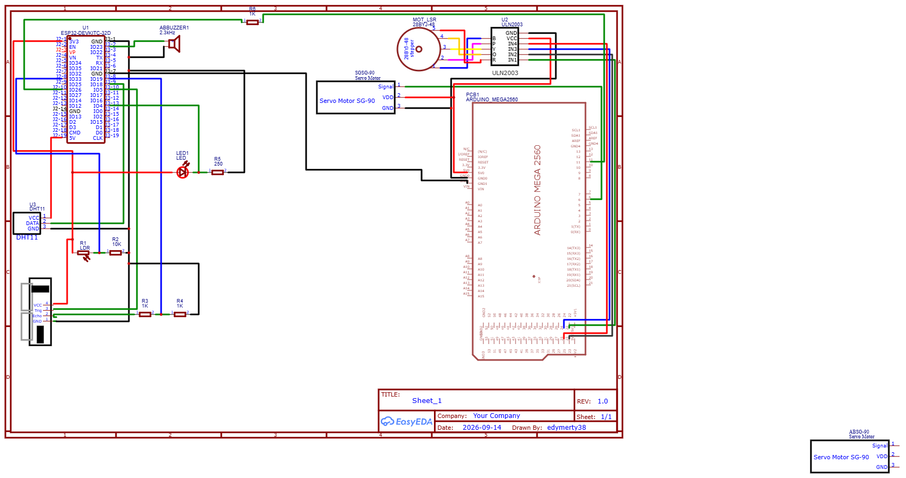

# ESP32 Soft-PLC & SCADA Node

An industrial-grade Soft-PLC firmware built on the ESP32 platform, utilizing FreeRTOS for deterministic multi-tasking and Modbus TCP for seamless integration with SCADA/HMI systems.
(not ready at the moment)

---

## Overview

The system operates as an edge automation controller capable of real-time multi-sensor acquisition, local interlock and alarm processing, and industrial networking over Wi-Fi. It runs dedicated FreeRTOS tasks to decouple sensor sampling from the Modbus communication engine.

### Key Features
* **Dual-Core Task Scheduling:** Sensor acquisition pinned to Core 0; network communication and Modbus server managed on Core 1.
* **Modbus TCP Server:** Implemented on standard port 502 with holding registers mapped for analog and telemetry values.
* **Deterministic I/O Control:** Native ESP-IDF GPIO driver configuration for alarm peripherals (LED, Active Buzzer).
* **Mixed-Level Interfacing:** Protected serial/digital interfacing with secondary microcontrollers (e.g., Arduino Mega for motor drive subsystems) via common ground and current-limiting networks.

---

## Hardware Architecture

| Component | Interface / Pin | Description |
| :--- | :--- | :--- |
| **ESP32 DevKit** | MCU Core | FreeRTOS Soft-PLC Engine |
| **DHT11** | Dedicated GPIO | Ambient Temperature & Relative Humidity |
| **HC-SR04** | Trigger / Echo GPIOs | Ultrasonic Distance Measurement |
| **LDR Photoresistor** | ADC Pin | Ambient Light Raw ADC Reading |
| **Active Buzzer** | Digital Output GPIO | Acoustic Alarm Signaling |
| **Status LED** | Digital Output GPIO | Visual Alarm Indication |

| Component | Interface / Pin | Description |
| :--- | :--- | :--- |
| **Arduino Mega 2590** | Motor Core | Act motors based on ESP32 |
| **Stepper Motor** | Digital Output GPIO | Control some processes |
| **SG90** |  PWM PIN | Control some processes |

## Electical diagram

> 📄 **Download / View:** [Open Schematic PDF](./docs/Schematic_plc_type_prj_2026-09-14.pdf)

## Modbus Register Mapping

The server provides Holding Registers (`Function Code 0x03` / `0x06`) starting at base offset **100**:

| Register Address | Variable | Unit / Scale Factor | Description |
| :---: | :--- | :---: | :--- |
| `100` | Temperature | $\times 10$ ($^\circ\text{C}$) | Ambient temperature (e.g. $276 \rightarrow 27.6^\circ\text{C}$) |
| `101` | Humidity | $\times 10$ ($\%$) | Relative humidity (e.g. $432 \rightarrow 43.2\%$) |
| `102` | Distance | $\text{cm}$ | Measured distance from ultrasonic sensor |
| `103` | LDR Raw | Raw ADC ($0 - 4095$) | Ambient illumination sensor level |

## Software Stack

* **Framework:** PlatformIO / Arduino Core with native ESP-IDF driver calls (`driver/gpio.h`)
* **RTOS:** FreeRTOS (multitasking via pinned tasks, tick-based delays)
* **Industrial Protocol:** `emelianov/modbus-esp8266` (Modbus TCP Server)

---
