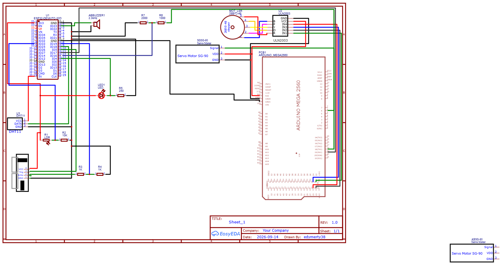

# ESP32 Soft-PLC & SCADA Node

An industrial-grade Soft-PLC firmware built on the ESP32 platform, utilizing FreeRTOS for deterministic multi-tasking and Modbus TCP for seamless integration with SCADA/HMI systems.

---
## IMPORTANT
"UART handshake ACK timing between Mega and ESP32 state machine during conveyor transport state is currently being fine-tuned (occasional state timeout under high loop frequency)."

## Overview

The system operates as an edge automation controller capable of real-time multi-sensor acquisition, local interlock and alarm processing, and industrial networking over Wi-Fi. It runs dedicated FreeRTOS tasks to decouple sensor sampling from the Modbus communication engine.

### Key Features
* **Dual-Core Task Scheduling:** Sensor acquisition pinned to Core 0; network communication and Modbus server managed on Core 1.
* **Modbus TCP Server:** Implemented on standard port 502 with holding registers mapped for analog and telemetry values.
* **Deterministic I/O Control:** Native ESP-IDF GPIO driver configuration for alarm peripherals (LED, Active Buzzer).
* **Mixed-Level Interfacing:** Protected serial/digital interfacing with secondary microcontrollers (e.g., Arduino Mega for motor drive subsystems) via common ground and current-limiting networks.

---

## Hardware Architecture

| Component | Interface / Pin | Description |
| :--- | :--- | :--- |
| **ESP32 DevKit** | MCU Core | FreeRTOS Soft-PLC Engine |
| **DHT11** | Dedicated GPIO | Ambient Temperature & Relative Humidity |
| **HC-SR04** | Trigger / Echo GPIOs | Ultrasonic Distance Measurement |
| **LDR Photoresistor** | ADC Pin | Ambient Light Raw ADC Reading |
| **Active Buzzer** | Digital Output GPIO | Acoustic Alarm Signaling |
| **Status LED** | Digital Output GPIO | Visual Alarm Indication |

| Component | Interface / Pin | Description |
| :--- | :--- | :--- |
| **Arduino Mega 2590** | Motor Core | Act motors based on ESP32 |
| **Stepper Motor** | Digital Output GPIO | Control some processes |
| **SG90** |  PWM PIN | Control some processes |

## Electical diagram

> 📄 **Download / View:** [Open Schematic PDF](./docs/Schematic_plc_typeV2.pdf)

## Modbus Register Mapping

The server provides Holding Registers (`Function Code 0x03` / `0x06`) starting at base offset **100**:

| Register Address | Variable | Unit / Scale Factor | Description |
| :---: | :--- | :---: | :--- |
| `100` | Temperature | $\times 10$ ($^\circ\text{C}$) | Ambient temperature (e.g. $276 \rightarrow 27.6^\circ\text{C}$) |
| `101` | Humidity | $\times 10$ ($\%$) | Relative humidity (e.g. $432 \rightarrow 43.2\%$) |
| `102` | Distance | $\text{cm}$ | Measured distance from ultrasonic sensor |
| `103` | LDR Raw | Raw ADC ($0 - 4095$) | Ambient illumination sensor level |

## Software Stack

* **Framework:** PlatformIO / Arduino Core with native ESP-IDF driver calls (`driver/gpio.h`)
* **RTOS:** FreeRTOS (multitasking via pinned tasks, tick-based delays)
* **Industrial Protocol:** `emelianov/modbus-esp8266` (Modbus TCP Server)

---

Process Flow & Finite State Machine (FSM)

The operational logic on the ESP32 cycles through five primary states:

1. **`STATE_IDLE`**:  
   The ultrasonic sensor (`HC-SR04`) monitors the infeed station. Once an object is confirmed within 10 cm over consecutive readings, the detection coil is flagged and the system initiates transport.

2. **`STATE_TRANSPORT_TO_QC`**:  
   ESP32 issues a `CMD_STEPPER_RUN` command to the Arduino Mega. The Mega steps the 28BYJ-48 motor asynchronously using Timer 1. If physical transport exceeds the safety deadline (`transportTimeOut`), the system trips into emergency stop. When transport finishes, the Mega replies with an acknowledge frame (`CMD_ACK_DONE`), transitioning the line to inspection.

3. **`STATE_QC_INSPECTION`**:  
   The station reads the environmental and optical characteristics of the part:
   * **Ambient validation:** DHT11 temperature and relative humidity.
   * **Surface reflection / Color check:** Analog photoresistor (LDR).  
   Values are matched against configurable thresholds stored in Modbus Holding Registers (`temp_threshold`, `ldr_threshold`, `hum_threshold`). The part is marked either **Conforming (OK)** or **Non-Conforming (Reject)**.

4. **`STATE_TRANSPORT_TO_SORT`**:  
   The conveyor advances the inspected part toward the sorting diverter chute.

5. **`STATE_SORT`**:  
   * **Accepted parts:** Servomotor remains at default position (0°), permitting the part to slide into the finished batch bin (`total_ok_pieces++`).
   * **Rejected parts:** Servomotor actuates to 90° for 800 ms, redirecting the defective part onto the scrap chute, and then resets (`total_rejects++`).  
   The line resets internal flags and returns to `STATE_IDLE`.

6. **`STATE_EMERGENCY`**:  
   Triggered on conveyor timeouts or external emergency commands. All actuators are immediately halted, Modbus run coils are cleared, and audiovisual alarms (Red LED + Active Buzzer) are latched.

---

## Communication Protocol (ESP32 <-> Mega)

Commands and handshakes are transmitted using a fixed 4-byte binary frame:

| Byte Index | Field | Description | Example (Transport Run) | Example (ACK Done) |
| :---: | :---: | :--- | :---: | :---: |
| **0** | `HEADER` | Frame sync delimiter (`0xAA`) | `0xAA` | `0xAA` |
| **1** | `CMD` | Command identifier byte | `0x01` (`CMD_STEPPER_RUN`) | `0x06` (`CMD_ACK_DONE`) |
| **2** | `VAL` | Parameter payload / Steps factor / Angle | `0x14` (20 units) | `0x01` (Success) |
| **3** | `CHK` | Longitudinal Redundancy XOR Checksum | `HEADER ^ CMD ^ VAL` | `HEADER ^ CMD ^ VAL` |

---
